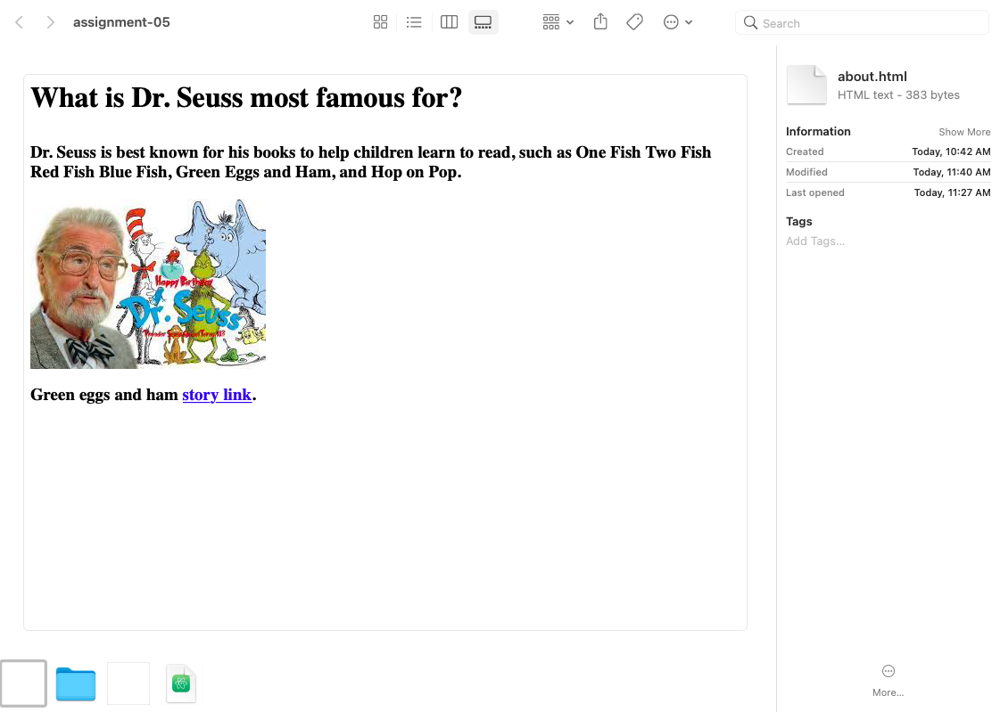

# Wyatt O'Day

Using your recommendation I visited the MTV website and it had a display of Beavis and Butt-Head a show that is still around today, however it is not as popular. It looked very simplified with lines of color down the webpage, now the website has links to different shows and has a fans favorite list.

I learned how to used links and embedded images through relative url. Remembering all the steps and remembering to save to display new changes has been most difficult. However it is rewarding when it all works as it should.

